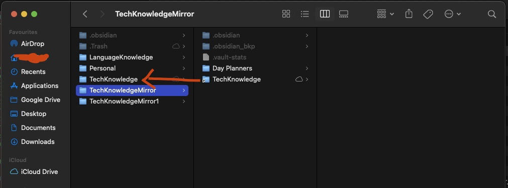

## Obsidian Mirror Plugin

Here we are, you have multiple monitors (sometimes I have up to 6 monitors) and you want to be 200% productive with Obsidian.

On one monitor you have a file opened and on another monitor you want to have a **full screen** `local graph` that helps you to connect the dots (in your mind)

Why? simply because the local graph in the same Obsidian instance is too small!

I was desperate and fortunately I found a workaround to run multiple instances of Obsidian in the forum using *symlink* [here](https://forum.obsidian.md/t/floating-pop-out-multiple-windows-of-the-same-vault/837/58)
NB: *symlink* to create virtual links. 

After successfully created symlinks `ln -s` you should be able to have a "mirror" Vault which will contain the symlink of the main Vault you want to use.

Here is an example:

Unfortunatelly this solution partially works cause when I switch context from the main Obsidian's instance, there is no way to propagate this to a second obsidian's instance.

So I created (in several hours) this plugin that syncs the active file among different Obsidian's instances.

Here's a quick gif that shows how it works (right side the main Obsidian'instance, left side the secondary *mirror* obsidian's instance)

This plugin is far from being perfect. I rely on the community to enhance it and make it more rubust.

In the meantime, if you are not a developer, you can FINALLY use the precious **local graph** on a different monitor.

## Installation Info

This plugin is not (yet) available in the official plugin lists. I created a pull request and waiting for a confirmation.

### Manual
1) Download/clone this repo
2) Copy the folder `obsidian-mirror` to the `plugin` folder of the main Obsidian's instance
3) Copy the same folder `obsidian-mirror` to the `plugin` folder of the second Obsidian's instance
4) Activate the plugin in both obsidian's instances
5) Go in the settings of both Obsidian's instances
6) Make sure you configure exactly the same info in both instance's
7) Put the **main** vault's name (Voult's name of the main Obsidian's instance)
8) Chose a name for the file that the plugin will use to sync the workspaces

### Official
*pending approval*

## Additional Info
The fastes way that came in my mind in order to sync the opened file among different instances was to us a *temporary* file in the main Vault.

The main instance of Obsidina will write the active file path in the temporary file and the secondary instance will read that content and open the active file.

No timer/setinterval mechanisms are used. Everything is *event based*. Obsidian writes/reads the file content only when it changes.

Enjoy!